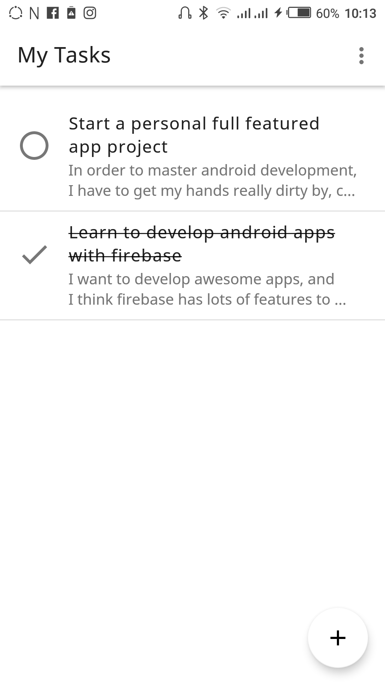
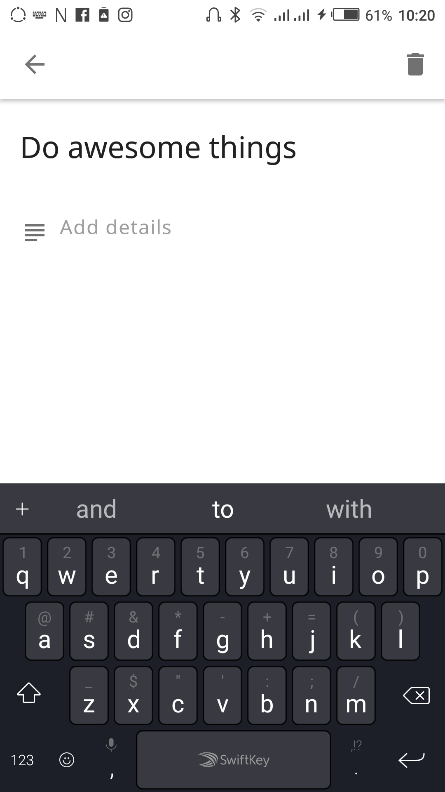
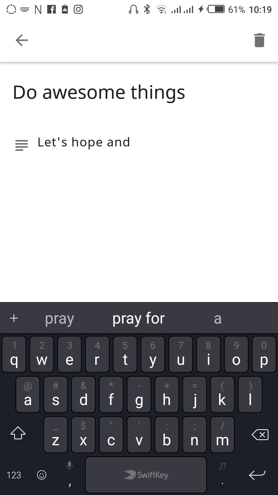

Tasks app for ALC 4.0
========================


A simple task app that make use of [Firebase Firestore](https://firebase.google.com/products/firestore/) for storage and online synchronization.

Authentication is provided by [Firebase Auth ](https://firebase.google.com/products/auth/) using the [Firebase Auth UI Kit](https://github.com/firebase/FirebaseUI-Android)

### Screenshots
<p align="center">
<a href="" target="_blank" alt="My Tasks"></a>
<a href="" target="_blank" alt="Add Task"></a>
<a href="" target="_blank" alt="Add Task"></a>
</p>

To build this project, you want to clone the repository in Android Studio. Connect the project to Firebase by using the Android Studio Firebase Assistant.

Click File -> Firebase -> Step 1, connect to firebase. 

A dialog will appear, if you have not logged in previously to Google, it will take you to a browser page to do so. You also will be required to grant Android Studio some permissions.

After this, you will be requested to create a new project on firebase using the dialog or select existing one.

Once you are done creating the project, Android Studio will synchronize your project and download the google-services.json file.

Next you want to login to your firebase console, select the project you just created, and enable database (firestore). 

In the database rules tab, replace the rule with this,

```
rules_version = '2';
service cloud.firestore {
  match /databases/{database}/documents {
    match /users/{userId}/tasks/{document=**} {
      allow read, write: if request.auth.uid == userId;
    }
  }
}
```

### Configure Authentication

Go to Authentication in the firebase console, in Sign in methods, enable email/password sign in. Click save.

After this build and run the app. Cheers!

